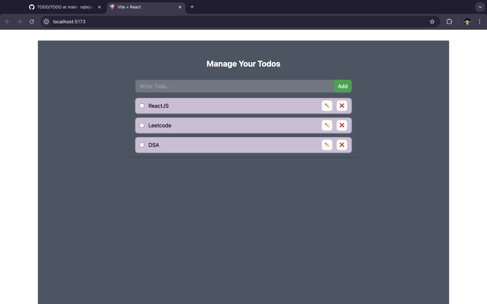
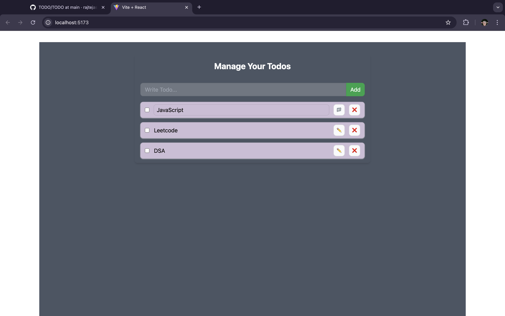
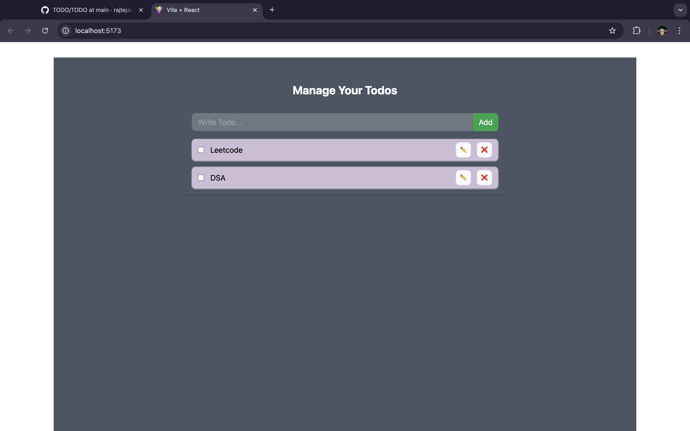
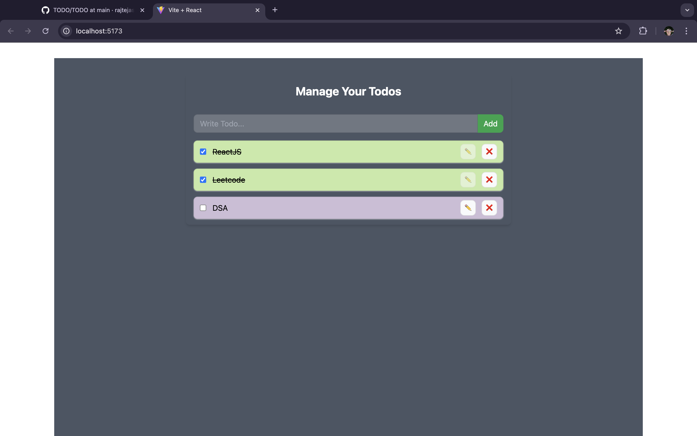

# Todo App

A simple and intuitive Todo application built with React and Vite. This app lets users add, update, delete, and toggle the status of todos. The UI is designed with Tailwind CSS, giving it a clean and responsive look.

## Features

- **Add Todo:** Easily add new tasks to your list.
- **Update Todo:** Modify the text of existing todos.
- **Delete Todo:** Remove completed or irrelevant tasks.
- **Toggle Todo:** Mark tasks as completed or uncompleted.

## Tech Stack

   

- **React.js:** Core library for building the UI, utilizing `useState`, `useEffect`, and `Context API` for state management and reactivity.
- **Vite:** Fast and lightweight development environment with HMR (Hot Module Replacement) for rapid development.
- **Tailwind CSS:** Utility-first CSS framework for styling.
## Starting with React + Vite

This project is built using Vite, which provides a minimal setup to get React running with HMR and ESLint rules.

### Plugins Used

- [@vitejs/plugin-react](https://github.com/vitejs/vite-plugin-react/blob/main/packages/plugin-react/README.md) - Uses [Babel](https://babeljs.io/) for Fast Refresh
- [@vitejs/plugin-react-swc](https://github.com/vitejs/vite-plugin-react-swc) - Uses [SWC](https://swc.rs/) for Fast Refresh

## Screenshots

|  |  | 
|------------------------------------------|------------------------------------------|
|  |  | 

## Code Overview

### `useState`

Manages the state of todos, including new additions, updates, and deletions.

### `useEffect`

Syncs todos with local storage or external APIs when needed.

### Context API

Provides global state management, making the state accessible throughout the component tree without prop drilling.

## License

This project is licensed under the MIT Lisence.
